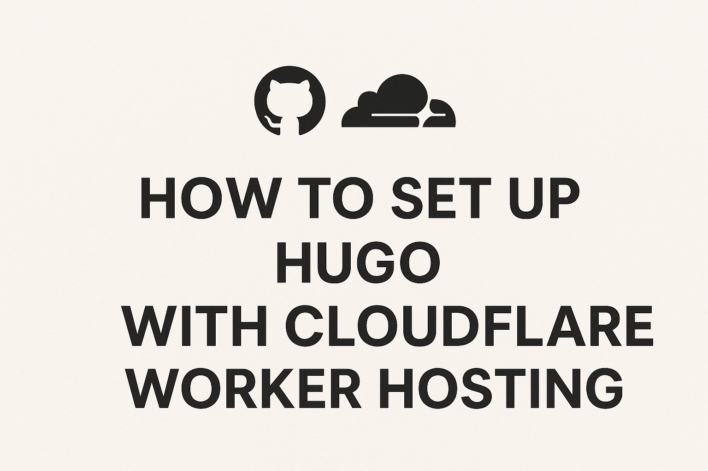

+++
date = '2025-11-26'
draft = false
title = 'Hugo setup'
summary = 'How I got this website up and runnning with GitHub and Cloudflare Workers.'
+++



## Intro

For my second post, I'd like to go over what I did to get this site online.

There are a few different options to deploy a Hugo site. I chose to store my site in GitHub and then use Cloudflare Workers & Pages to build and host the site.

As to why I chose them, well you can't argue with free, though there's more to it than zero cost. GitHub as a code repo has become the gold standard for personal projects and open source, whereas GitLab is more enterprise focused, which I do enjoy using at work. CloudFlare Pages has distinct advantages over Netlify, GitHub pages, etc. Cloudflare's global presence with CDN and DNS makes it blazingly fast. CF also grants you free DDoS protection and some other goodies too.

## Local setup
This is for a Windows machine. If you're using Mac there are many other guides out there that use Hombrew.

- Go - [Windows binary installer](https://go.dev/doc/install)
- Hugo
```
winget install Hugo.Hugo.Extended
```
- Git
```
winget install --id Git.Git -e --source winget
```
- Chocolatey - [Follow PowerShell install](https://chocolatey.org/install#individual)
- Dart Sass
```
choco install sass
```

## Create a new project
1. Create the site.
```
hugo new site my-hugo-site
```

2. Install a theme. [See Congo's install page.](https://jpanther.github.io/congo/docs/installation/) You'll have to copy some .toml files from Congo's bundle into your config directory. Pay close attention to moving hugo.toml to its new location and not overwriting it when you copy the configs from the Congo bundle.

3. Create a post and start writing!

4. Add a .gitignore to the root of the project so you aren't committing rendered files. See [my .gitignore](https://github.com/warren-roberts/wrnet-web/blob/main/.gitignore).

## Commit to GitHub
You need to create a repo on GitHub solely for the site. [Here's my repo.](https://github.com/warren-roberts/wrnet-web)
```
cd my-hugo-site
git init
git remote add origin https://github.com/<your-gh-username>/<repository-name>
git branch -M main
git push -u origin main
```

There's your first commit! From there, you'll need to do another commit to set up the build process at Cloudflare. For now, don't bother with branches, though I did.

## Cloudflare setup
### Move your domain to Cloudflare
I moved warrenroberts.net from my registrar's nameservers, GoDaddy, to Cloudflare via their DNS portals. Ensure you download a copy of your zonefile before you do this. Move all of your DNS records to the new zone in Cloudflare before you point to CF's nameservers.

You will also need to delete the A records that point to your existing website, if any. Cloudflare will manage the new DNS records automatically for the new site.

### Create a Worker
This section is best left to the [official docs on GoHugo](https://gohugo.io/host-and-deploy/host-on-cloudflare/). Follow the guide to create wrangler.toml and build.sh in your project and commit to GitHub. Then you will create the Worker in the Cloudflare portal and point it to your GitHub as the source. You will basically leave everything to their default values.

### Redirect and TLS tweaks
This is optional. I set up some tweaks of my own to redirect www.warrenroberts.net to warrenroberts.net as well as forcing http traffic to TLS encrypted https.
- Set up Bulk redirect to drop www.
    - Under Delivery & performance, click Bulk redirects.
    - Create a Bulk redirect list. Put in the www.domainname.tld as source and domainname.tld as the destination.
    - Create a Bulk Redirect rule that utilizes the list.
- Encrypt all visitor traffic
    - See [this section](https://developers.cloudflare.com/ssl/edge-certificates/additional-options/always-use-https/#encrypt-all-visitor-traffic)

## Final thoughts

This wasn't that bad of a setup. I pulled one late night to get it done. It certainly isn't as easy as deploying a WordPress, but the ease of mind, security, and performance of Hugo makes up for that many times over.

This could easily be done in 3 hours if you didn't get misdirected into doing some wrong, outdated things, so follow GoHugo and my guide!

Other than that, I thought I messed up after reading that Cloudflare Pages was deprecated and that folks are having to migrate existing sites to Workers. Thankfully for us just getting started, new sites are automatically created as "Workers & Pages". Dodged a bullet there.

### Information sources

[GoHugo - Host on Cloudflare](https://gohugo.io/host-and-deploy/host-on-cloudflare/) - These steps are the best. Use this!

[Cloudflare Docs - Hugo](https://developers.cloudflare.com/pages/framework-guides/deploy-a-hugo-site/#deploy-with-cloudflare-pages) - There are a couple of problems with this doc:
- Git submodules shouldn't be used. Hugo Modules are the preferred way to reference themes.
- Build config will use a very old version of Hugo. We will override this later with a build script.

[Pablo Gonzales - Setting Up a Static Page with Hugo, Cloudflare, and Umami Analytics](https://pablogonzalez.me/posts/personal_webpage/) - Great guide. Wish I found it earlier.
- Not a fan of setting the env variables rather than using a build script.
- Great part on Umami analytics which I'll definitely be setting up.

