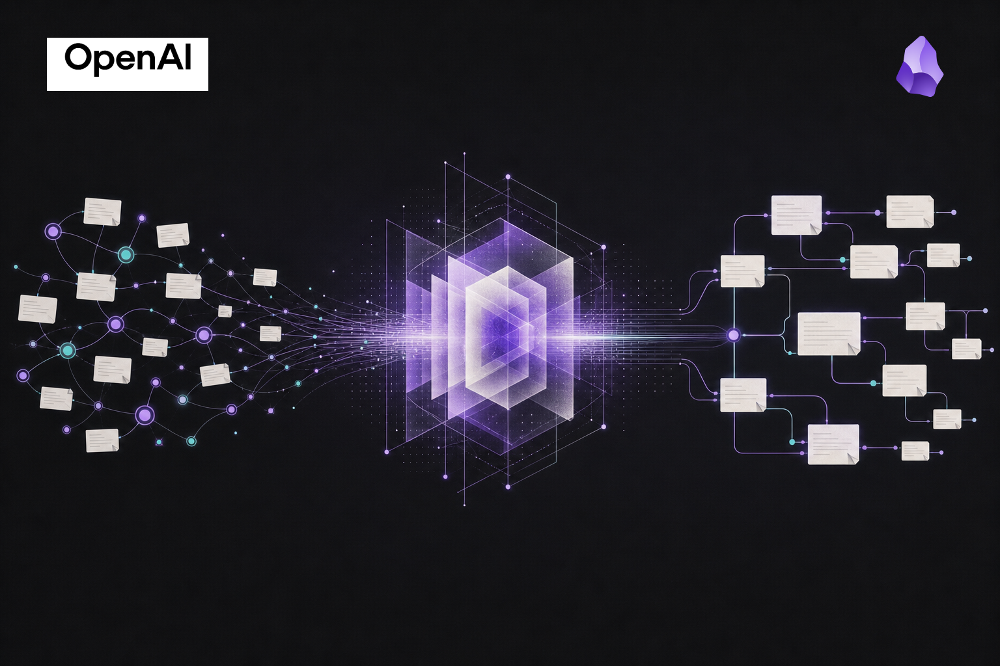

+++
date = '2026-07-23'
draft = false
title = 'Your Second Brain Needs a Compiler'
summary = 'Retrieval can recall your notes. A maintained LLM wiki can turn them into knowledge that compounds.'
images = ['second-brain-compiler.png']
+++

*OpenAI and Obsidian marks are used only to identify the tools discussed here and do not imply endorsement or partnership.*

## The broken promise of a second brain

Most "second brains" become another attic. We clip articles, save links, take notes, and promise ourselves that the collection will become useful later. Then later arrives, and finding the connection between three old notes means remembering that the connection exists in the first place.

Retrieval-augmented generation improves the search problem, but it does not solve the knowledge problem. Upload a pile of documents and an LLM can retrieve relevant fragments and assemble an answer. Ask a harder question tomorrow, and it starts the assembly work again. The answer may be useful, but the insight is still trapped in a one-off conversation.

[Andrej Karpathy's LLM Wiki pattern](https://gist.github.com/karpathy/442a6bf555914893e9891c11519de94f) proposes a more ambitious idea: compile knowledge once, then keep compiling it as new material arrives. The durable product is not a chat history or a vector index. It is a living, inspectable wiki.

## Compile, don't retrieve

The model has three clean layers. Raw sources remain immutable: articles, transcripts, papers, and notes are the evidence. A wiki of interconnected Markdown pages is the working synthesis: concepts, entities, comparisons, and open questions. A small instruction file supplies the schema—the rules that tell the agent how to ingest, link, cite, revise, and maintain the whole thing.

That distinction matters. When a new source arrives, the agent does more than store it for possible retrieval. It updates the relevant pages, adds missing links, records contradictions, and improves the existing synthesis. A useful answer to a question can also become a page instead of disappearing with the chat session. Periodic linting looks for orphaned pages, stale claims, weak links, and questions worth investigating next.

This is why the compiler metaphor fits. Sources are input. The wiki is the compiled artifact. Every ingestion, query, and maintenance pass can leave the artifact more coherent than it was before.

## Codex writes; Obsidian makes it legible

Codex and Obsidian are the practical version of this idea in 2026. Codex can read across a Markdown codebase, make coordinated updates, and follow instructions that evolve with the knowledge base. Obsidian gives the human a fast, local interface for reading the result, following links, seeing the graph, and challenging what the agent produced. The agent is the maintainer; the vault is the codebase; Obsidian is the place where the work becomes understandable.

That does not make knowledge management automatic. Humans still choose the sources, insist on provenance, correct bad synthesis, and decide which questions deserve attention. The model removes the bookkeeping: the tedious, fragile work of keeping dozens of pages connected as understanding changes.

The point is not to create more notes. It is to create a map whose claims can be traced back to evidence, whose gaps are visible, and whose structure gets better each time you return to it.

For readers who want an implementation reference, [Obsidian Wiki](https://github.com/Ar9av/obsidian-wiki) is a Codex-compatible framework for this pattern. The bigger point is simpler: stop treating your notes as a warehouse to search. Build a system that turns them into knowledge you can inspect, improve, and keep.

Personally, I used Codex to find the Obsidian vault and update it directly with no plugins involved. Ask ChatGPT what you should do, how to structure AGENTS.md for an LLM wiki. My first prompt down this rabbithole was "how do I hook up Obsidian to Codex in order to build the second brain that Andrej Karpathy discussed in his gist". That should get you very far if you're good at follow up prompts.
